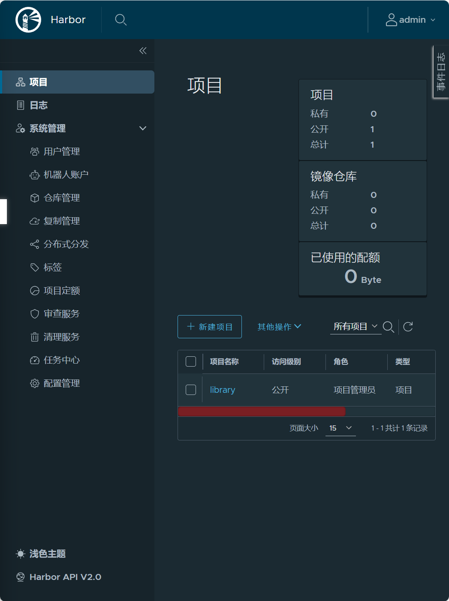

## 初始化项目结构

[cobra](https://github.com/spf13/cobra)安装
```
go get -u github.com/spf13/cobra@v1.8.0
go install github.com/spf13/cobra-cli@latest
# 配置gobin到环境变量 $GOBIN根据自己的go env gobin对应的地址去做替换
export PATH=$PATH:$GOBIN
```

## 初始化web模块 Gin

安装[Gin](https://github.com/gin-gonic/gin)
```
go get -u github.com/gin-gonic/gin@v1.10.0
```

## 功能开发
- [x] 首页（展示服务间的调用关系）
- [x] 图书详情页


## Bookinfo docker构建部署
在bookinfo目录下使用指令
docker build -t bookinfo:v0.1 .
docker run -p8002:8080 -d  bookinfo:v0.1
curl localhost:8002

https://goharbor.io/docs/2.12.0/install-config/
gencert.sh
```
openssl genrsa -out ca.key 4096

openssl req -x509 -new -nodes -sha512 -days 3650 \
 -subj "/C=CN/ST=Beijing/L=Beijing/O=example/OU=Personal/CN=MyPersonal Root CA" \
 -key ca.key \
 -out ca.crt

openssl genrsa -out harbor.com.key 4096

openssl req -sha512 -new \
    -subj "/C=CN/ST=Beijing/L=Beijing/O=example/OU=Personal/CN=harbor.com" \
    -key harbor.com.key \
    -out harbor.com.csr


cat > v3.ext <<-EOF
authorityKeyIdentifier=keyid,issuer
basicConstraints=CA:FALSE
keyUsage = digitalSignature, nonRepudiation, keyEncipherment, dataEncipherment
extendedKeyUsage = serverAuth
subjectAltName = @alt_names

[alt_names]
DNS.1=harbor.com
DNS.2=yourdomain
DNS.3=hostname
EOF

openssl x509 -req -sha512 -days 3650 \
    -extfile v3.ext \
    -CA ca.crt -CAkey ca.key -CAcreateserial \
    -in harbor.com.csr \
    -out harbor.com.crt


mkdir -p /data/cert/
cp harbor.com.crt /data/cert/
cp harbor.com.key /data/cert/

openssl x509 -inform PEM -in harbor.com.crt -out harbor.com.cert


cp harbor.com.cert /etc/docker/certs.d/harbor.com/
cp harbor.com.key /etc/docker/certs.d/harbor.com/
cp ca.crt /etc/docker/certs.d/harbor.com/

systemctl restart docker
```


sudo yum install tree
tree
└── harbor.com
    ├── ca.crt
    ├── harbor.com.cert
    └── harbor.com.key


cp harbor.yml harbor.yml.tmpl
docker load < harbor.v2.13.0.tar.gz

vim harbor.yml

ls /data/cert/

修改harbor.yml 
```
[root@192 harbor]# vim harbor.yml
# Configuration file of Harbor

# The IP address or hostname to access admin UI and registry service.
# DO NOT use localhost or 127.0.0.1, because Harbor needs to be accessed by external clients.
hostname: harbor.com

# http related config
http:
  # port for http, default is 80. If https enabled, this port will redirect to https port
  port: 80

# https related config
https:
  # https port for harbor, default is 443
  port: 443
  # The path of cert and key files for nginx
  certificate: /data/cert/harbor.com.crt
  private_key: /data/cert/harbor.com.key
```

docker compose up -d


vim harbor.yml 查看初始密码
