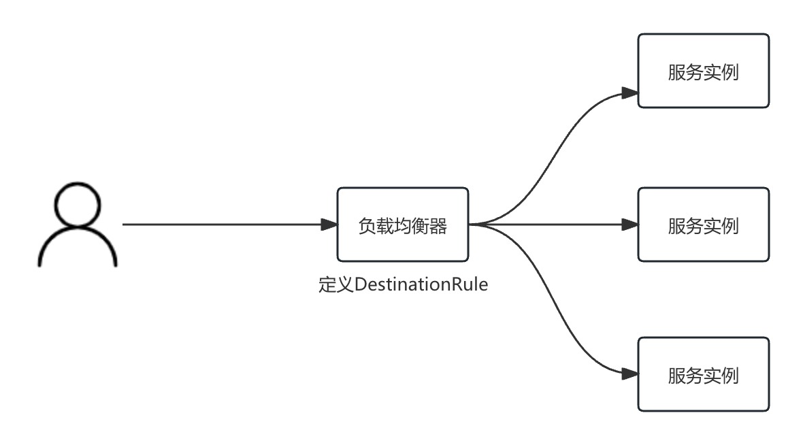

# 负载均衡

## 标准算法
ROUND_ROBIN：轮询算法，默认。

LEAST_CONN：权重最小请求算法。该算法选择两个随机的服务实例，并选择活动请求较少的服务实例。

RANDOM：随机算法。该算法选择一个随机的健康服务实例。如果未配置运行状况检查策略，则随机负载均衡器的性能通常比轮询更好。

PASSTHROUGH：该算法将连接转发到调用者请求的原始 IP 地址，而不进行任何形式的负载平衡。需谨慎使用，它适用于特殊场景。

配置举例：
```
trafficPolicy:
  loadBalancer:
    simple: ROUND_ROBIN
```

## consistentHash（一致 Hash 算法）
该算法可提供基于 HTTP 头、Cookie 等一致 Hash 算法，仅适用于HTTP 请求，常作为基于会话保持的负载均衡算法。

举例：
```
trafficPolicy:
  loadBalancer:
    consistentHash:
      useSourceIp: true
```

## localityLbSetting（地域负载均衡）
提供了地域感知的能力，简单说来，就是在分区部署的较大规模的集群，或者公有云上，Istio 负载均衡可以根据节点的区域标签，对调用目标做出就近选择。这些区域是使用任意标签指定的，这些标签以{region} / {zone} / {sub-zone}形式指定区域的层次结构。

举例：
```
trafficPolicy:
  loadBalancer:
    localityLbSetting:
        enabled: true
        # 流量分发
        distribute:
        - from: beijing/*        # 请求来自 北京 的客户端
          to:
            "beijing/*": 80      # 80% 流量分配到 北京 区域
            "shanghai/*": 20      # 20% 流量分配到 上海 区域
        # 故障转移
        failover:
        # 如果北京没有可用实例，转移到上海
        - from: beijing
          to: shanghai
        # 如果上海没有可用实例，转移到深圳
        - from: shanghai
          to: shenzhen
```