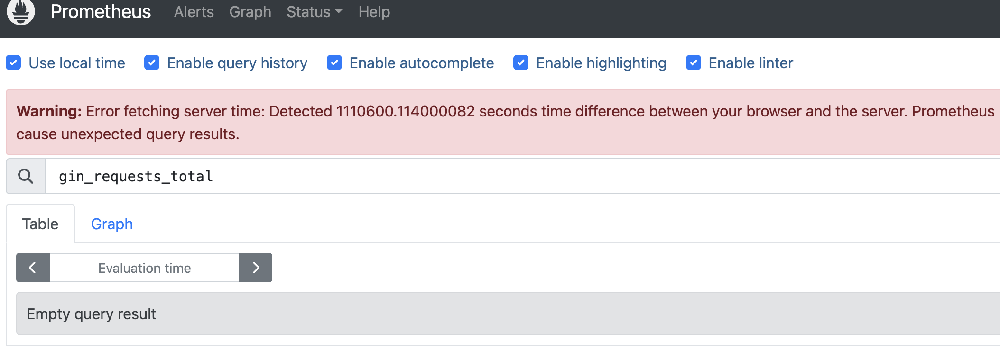

# minikube 时间同步问题
此问题在基于mac下的qemu下发现，系统时间存在极大误差，表现为Prometheus无法查询指标。
如图：

## 解决办法

检查minikube时间同步组件：
`sudo systemctl status systemd-timesyncd.service`
会发现时间同步服务无法访问

`sudo vi /etc/systemd/timesyncd.conf`
添加如下配置：
NTP=ntp.ntsc.ac.cn cn.ntp.org.cn
> 多个授时中心用空格隔开即可

重启时间同步服务
`sudo systemctl restart systemd-timesyncd.service`
